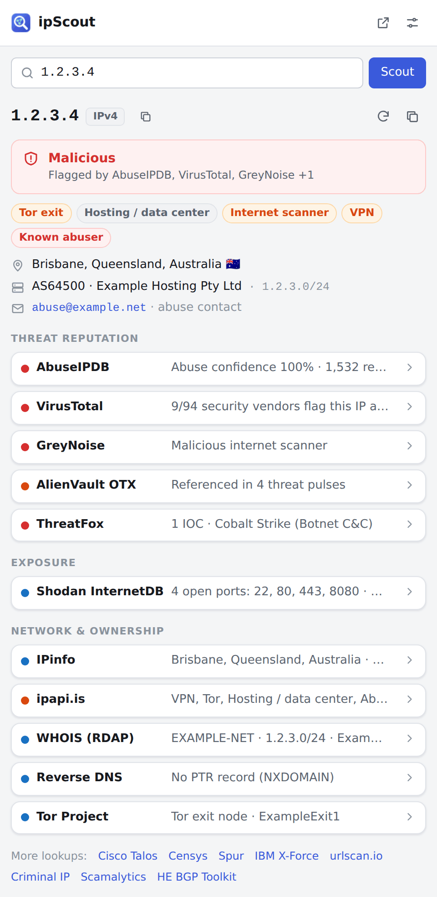
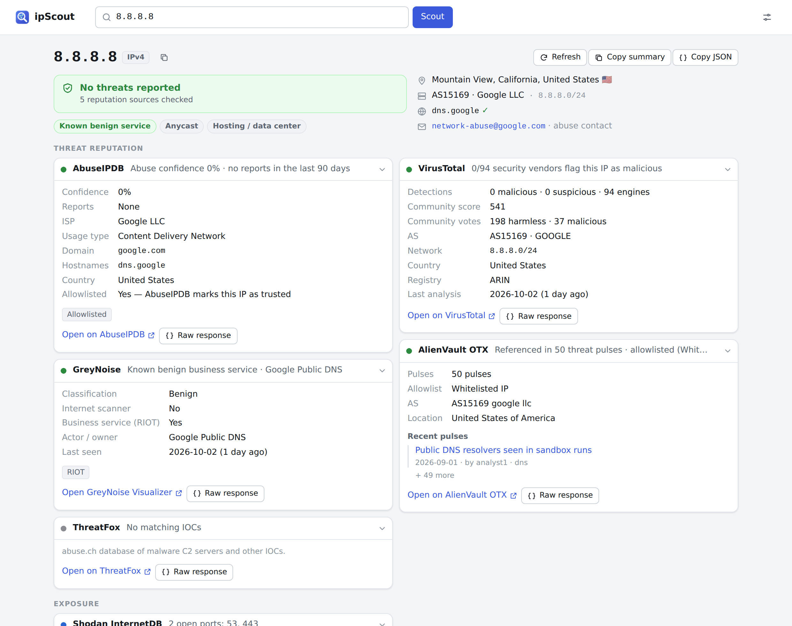

# ipScout

A Chrome extension for quick IP address research. Paste, select or right-click an IP and ipScout checks **11 free sources at once** — abuse reports, threat intel, open ports, geolocation, WHOIS, reverse DNS and Tor/VPN detection — and rolls them up into one verdict.

**8 sources work with no setup.** Three more (AbuseIPDB, VirusTotal, ThreatFox) need a free API key that takes a minute to create.

<p align="center">
  
</p>



<sub>Screenshots use mocked API responses. 1.2.3.4 is the usual placeholder address and its "malicious" data is made up.</sub>

## Features

- **One verdict from many sources.** Malicious / Suspicious / No threats reported, with the sources that flagged it, plus traits like _Tor exit_, _VPN_, _Hosting_, _Internet scanner_ or _Known benign service_.
- **Key facts up front:** location, ASN and owner, network range, reverse DNS (forward-confirmed), and the abuse contact to report to.
- **Many ways in:**
  - Toolbar popup (default shortcut <kbd>Alt</kbd>+<kbd>Shift</kbd>+<kbd>S</kbd>). If you've highlighted an IP on the page, it's checked right away; otherwise the popup lists IPs found on the page.
  - Right-click selected text → **Scout “…” with ipScout**, or right-click a link → **Scout this link’s host**.
  - Address bar: type `ip`, a space, then the address.
  - Full-page report you can bookmark or share: `results.html?q=<ip>`.
- **Paste anything:** IPv4 or IPv6, `ip:port`, URLs, hostnames (resolved via DNS-over-HTTPS), whole log lines, and defanged IOCs like `1.2.3[.]4` or `hxxps://evil[.]com`.
- **Safe by default:** private and reserved addresses (RFC 1918, CGNAT, loopback, documentation ranges, …) are recognised and never sent anywhere.
- **Built for analysts:** copy a plain-text summary (optionally defanged) or full JSON for tickets, view each source's raw API response, and jump to each site's own page for the IP.
- **Saves your free quota:** results are cached (6 hours by default, configurable), and Refresh fetches fresh data on demand.
- One-click links to sites without a free API: Cisco Talos, Censys, Spur, IBM X-Force, urlscan.io, Criminal IP, Scamalytics and Hurricane Electric BGP.

## Sources

| Source                                                  | What it tells you                                                 | API key      | Free tier                                 |
| ------------------------------------------------------- | ----------------------------------------------------------------- | ------------ | ----------------------------------------- |
| [AbuseIPDB](https://www.abuseipdb.com)                  | Abuse confidence score, report count, categories, recent comments | **Required** | 1,000 checks/day                          |
| [VirusTotal](https://www.virustotal.com)                | Verdicts from ~90 security vendors, community score               | **Required** | 500 lookups/day, 4/min, non-commercial    |
| [GreyNoise](https://www.greynoise.io)                   | Is it a mass internet scanner, or a known benign service (RIOT)?  | Optional     | Small daily allowance; more with a key    |
| [AlienVault OTX](https://otx.alienvault.com)            | Threat-intel pulses, related malware families                     | Optional     | Works without a key                       |
| [ThreatFox](https://threatfox.abuse.ch)                 | Known malware C2 / IOC entries                                    | **Required** | Free abuse.ch Auth-Key                    |
| [Shodan InternetDB](https://internetdb.shodan.io)       | Open ports, CVEs, hostnames, tags                                 | None         | Free, non-commercial                      |
| [IPinfo](https://ipinfo.io)                             | Geolocation, ASN / organisation, hostname, anycast                | Optional     | 1,000/day; 50,000/month with a token      |
| [ipapi.is](https://ipapi.is)                            | VPN, proxy, Tor, hosting and abuser detection, abuse contact      | Optional     | 1,000/day                                 |
| WHOIS via [RDAP](https://about.rdap.org)                | Registered owner, address range, abuse contact, dates             | None         | Free (regional internet registries)       |
| Reverse DNS                                             | PTR record, forward-confirmed (FCrDNS)                            | None         | Free (Google / Cloudflare DNS-over-HTTPS) |
| [Tor Project](https://metrics.torproject.org) (Onionoo) | Is it a Tor relay or exit node?                                   | None         | Free                                      |

GreyNoise and Shodan InternetDB are IPv4-only; everything else handles IPv6 too.

## Install

ipScout isn't on the Chrome Web Store yet, so load it unpacked:

1. Download or clone this repository.
2. Open `chrome://extensions` and switch on **Developer mode** (top right).
3. Click **Load unpacked** and choose the **`extension`** folder.
4. Pin ipScout from the puzzle-piece menu so the icon stays in your toolbar.

The settings page opens on first install. Other Chromium-based browsers (Edge, Brave, …) should also be able to load it from their own extensions page, though only Chrome/Chromium is tested.

### Getting the free API keys

| Source     | Where                                                                        | Notes                                                            |
| ---------- | ---------------------------------------------------------------------------- | ---------------------------------------------------------------- |
| AbuseIPDB  | [abuseipdb.com/account/api](https://www.abuseipdb.com/account/api)           | Free account → **Create Key**                                    |
| VirusTotal | [virustotal.com/gui/my-apikey](https://www.virustotal.com/gui/my-apikey)     | Free community account; the public API is for non-commercial use |
| ThreatFox  | [auth.abuse.ch](https://auth.abuse.ch/)                                      | One Auth-Key also works for URLhaus and MalwareBazaar            |
| GreyNoise  | [viz.greynoise.io/account/api-key](https://viz.greynoise.io/account/api-key) | Optional; raises the community lookup limit                      |
| OTX        | [otx.alienvault.com/api](https://otx.alienvault.com/api)                     | Optional                                                         |
| IPinfo     | [ipinfo.io/signup](https://ipinfo.io/signup)                                 | Optional; raises the limit to 50,000/month                       |

Paste keys into **ipScout → Settings** (the sliders icon in the popup). They save automatically.

## How the verdict works

Each source's result is reduced to a level:

| Source            | Malicious                 | Suspicious                                | Clean                                    |
| ----------------- | ------------------------- | ----------------------------------------- | ---------------------------------------- |
| AbuseIPDB         | confidence ≥ 75%          | confidence 25–74%                         | below 25%, or AbuseIPDB-allowlisted      |
| VirusTotal        | ≥ 3 vendors say malicious | 1–2 malicious, or any suspicious          | analysed, nothing flagged                |
| GreyNoise         | classified malicious      | scanning the internet with unknown intent | benign scanner or known business service |
| AlienVault OTX    | –                         | appears in pulses and isn't allowlisted   | on OTX's allowlist                       |
| ThreatFox         | any exact IOC match       | –                                         | –                                        |
| Shodan InternetDB | `c2` / `malware` tag      | `compromised` / `doublepulsar` tag        | –                                        |
| ipapi.is          | –                         | listed as an abuser                       | –                                        |

The overall verdict is the most severe level any source reports. Network sources (IPinfo, WHOIS, reverse DNS, Tor) are informational: they feed the facts and traits rather than the verdict. A Tor exit or VPN shows up as a trait, not as "malicious", because anonymising infrastructure isn't hostile by itself.

## Privacy and permissions

ipScout has no server. Lookups go straight from your browser to each source you enable, and only the IP (or hostname) you look up is sent.

| Permission                     | Why                                                                                                                                                                                        |
| ------------------------------ | ------------------------------------------------------------------------------------------------------------------------------------------------------------------------------------------ |
| `storage`                      | Your settings, API keys, cached results and recent lookups, kept locally in this browser                                                                                                   |
| `contextMenus`                 | The right-click **Scout with ipScout** entries                                                                                                                                             |
| `activeTab` + `scripting`      | When you open the popup, read the current page's selection (and visible text, to list IPs on the page). This happens only when you click the icon, and the text never leaves your browser. |
| Host access to the API domains | Calling the sources listed above. No access to the sites you browse.                                                                                                                       |

- API keys are stored in `chrome.storage.local` and sent only to the service they belong to, in request headers where the API allows it (ipapi.is only accepts its key in the URL).
- That storage is restricted to ipScout's own pages, so scripts running on websites, including the popup's page scan, can't read your keys. Chrome doesn't encrypt extension storage on disk, so anyone with access to your browser profile folder could still read them; you can revoke and regenerate a key on its site at any time.
- Requests never include your cookies for these sites, so lookups aren't tied to your logged-in accounts there.
- You can switch off page scanning, auto-lookup and any individual source in Settings, and clear the cache and history at any time.

Each source's free tier has its own terms. Several, including the VirusTotal public API and Shodan InternetDB, are for non-commercial use only.

## Development

No build step: the extension is plain JavaScript modules in `extension/`.

```
extension/
  manifest.json        Manifest V3
  background.js        Service worker: context menus, address-bar keyword, first-run page
  popup.html           Toolbar popup
  results.html         Full-page report
  options.html         Settings and API keys
  lib/
    ip.js              Parsing, IPv6 canonicalisation, special-range classification, extraction, refanging
    lookup.js          Runs sources in parallel, rolls up the verdict and facts
    providers/         One module per source
    http.js dns.js storage.js report.js format.js quicklinks.js
  ui/                  Rendering, controllers, styles (light and dark)
tests/
  unit/                Node test runner, no dependencies
  e2e/                 The real extension in Chromium via Playwright, all APIs mocked
  fixtures/            Mock responses in each API's documented format
scripts/               Icons, screenshots and Web Store packaging
```

```sh
npm test                      # unit tests (Node 22+, no install needed)
npm install                   # dev dependency: Playwright
npx playwright install chromium
npm run test:e2e              # loads the extension in Chromium against mocked APIs
npm run package               # dist/ipscout-<version>.zip for the Chrome Web Store
npm run icons                 # re-render PNG icons from extension/icons/*.svg
node scripts/screenshots.mjs  # regenerate the README screenshots
```

### Adding a source

Create `extension/lib/providers/<name>.js` exporting an object with `id`, `name`, `category` (`reputation`, `exposure` or `network`), `description`, `homepage`, `webUrl(ip)`, `key` (or `null`), `freeTier`, `ipv6` and `async lookup(ip, ctx)`. `lookup` calls `ctx.fetchJson(url, options)` and returns `{ verdict, summary, fields, tags, lists, flags, facts }` (see `providers/index.js` for the full shape). Then:

1. Register it in `providers/index.js`.
2. Add the API host to `host_permissions` in `manifest.json`. A unit test fails if you forget.
3. Add a mock response in `tests/fixtures/responses.js` and tests in `tests/unit/providers.test.js`.

## License

[MIT](LICENSE)
