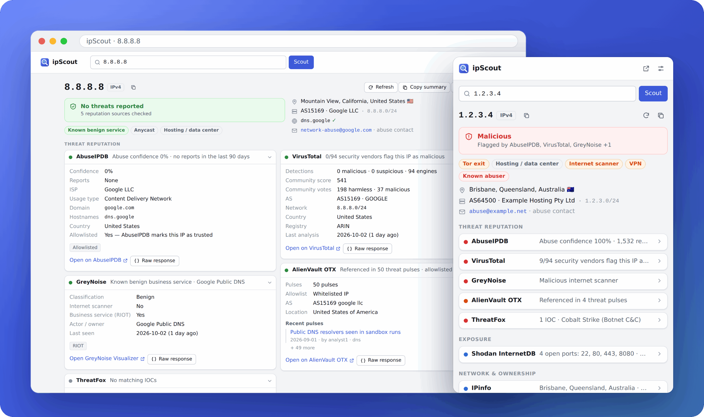
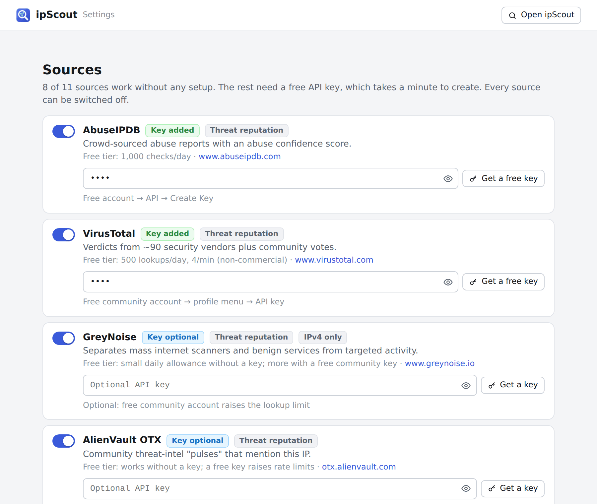

<p align="center">
  
</p>

<h1 align="center">ipScout</h1>

<p align="center">
  <strong>Research any IP address in one click, right from Chrome.</strong><br>
  Abuse reports, threat intel, open ports, geolocation, WHOIS, reverse DNS and Tor/VPN checks from 11 free sources, rolled up into one verdict.
</p>

<p align="center">
  <a href="https://github.com/Velidoran/ipscout-extension/actions/workflows/ci.yml"></a>
  <a href="LICENSE"></a>
  
  
</p>

<p align="center">
  <a href="#install">Install</a> ·
  <a href="#using-ipscout">Usage</a> ·
  <a href="#sources">Sources</a> ·
  <a href="#how-the-verdict-works">Verdicts</a> ·
  <a href="#privacy-and-permissions">Privacy</a> ·
  <a href="CONTRIBUTING.md">Contributing</a>
</p>

<p align="center">
  
</p>
<p align="center"><sub>Screenshots use mocked API data. 1.2.3.4 is the usual placeholder address; its "malicious" result is made up.</sub></p>

## Features

- **One verdict from 11 sources.** Malicious, Suspicious or No threats reported, naming the sources behind it, plus traits such as _Tor exit_, _VPN_, _Hosting_, _Internet scanner_ or _Known benign service_.
- **Works out of the box.** 8 sources need no setup. AbuseIPDB, VirusTotal and ThreatFox each need a free API key that takes a minute to create.
- **Key facts up front:** location, ASN and owner, network range, reverse DNS (forward-confirmed) and the abuse contact to report to.
- **Paste anything:** IPv4 or IPv6, `ip:port`, URLs, hostnames (resolved over DNS-over-HTTPS), whole log lines and defanged IOCs like `1.2.3[.]4` or `hxxps://evil[.]com`.
- **Private by design:** there's no ipScout server, and private or reserved addresses (RFC 1918, CGNAT, loopback, documentation ranges, …) are never sent anywhere.
- **Built for analysts:** copy a plain-text summary (optionally defanged) or JSON for tickets, inspect each source's raw API response, and jump to each site's own page for the IP.
- **Easy on free quotas:** results are cached (6 hours by default), and Refresh fetches fresh data when you need it.

## Install

ipScout isn't in the Chrome Web Store yet, so you load it as an unpacked extension:

1. Download `ipscout-<version>.zip` from the [latest release](https://github.com/Velidoran/ipscout-extension/releases/latest) and unzip it, or clone this repository.
2. Open `chrome://extensions` and switch on **Developer mode** (top right).
3. Click **Load unpacked** and select the unzipped folder (or the repository's `extension` folder).
4. Pin ipScout from the puzzle-piece menu so the icon stays in your toolbar.

The settings page opens on first install so you can add API keys. Other Chromium-based browsers (Edge, Brave, …) should also be able to load it from their own extensions page, though only Chrome/Chromium is tested.

## Using ipScout

- **Toolbar popup:** click the icon or press <kbd>Alt</kbd>+<kbd>Shift</kbd>+<kbd>S</kbd>. If you've highlighted an IP on the page it's checked straight away; otherwise the popup lists the IPs found on the page and your recent lookups.
- **Right-click:** select an IP (or a whole log line) and choose **Scout “…” with ipScout**, or right-click a link and choose **Scout this link’s host**.
- **Address bar:** type `ip`, a space, then the address.
- **Full report:** open any lookup in a tab for the complete report. Its address (`results.html?q=<ip>`) can be bookmarked.
- **More sites:** each report links to sites without a free API: Cisco Talos, Censys, Spur, IBM X-Force, urlscan.io, Criminal IP, Scamalytics and Hurricane Electric BGP.

## Sources

| Source                                                  | What it tells you                                                 | API key      | Free tier                                 |
| ------------------------------------------------------- | ----------------------------------------------------------------- | ------------ | ----------------------------------------- |
| [AbuseIPDB](https://www.abuseipdb.com)                  | Abuse confidence score, report count, categories, recent comments | **Required** | 1,000 checks/day                          |
| [VirusTotal](https://www.virustotal.com)                | Verdicts from ~90 security vendors, community score               | **Required** | 500 lookups/day, 4/min, non-commercial    |
| [GreyNoise](https://www.greynoise.io)                   | Is it a mass internet scanner, or a known benign service (RIOT)?  | Optional     | Small daily allowance; more with a key    |
| [AlienVault OTX](https://otx.alienvault.com)            | Threat-intel pulses, related malware families                     | Optional     | Works without a key                       |
| [ThreatFox](https://threatfox.abuse.ch)                 | Known malware C2 / IOC entries                                    | **Required** | Free abuse.ch Auth-Key                    |
| [Shodan InternetDB](https://internetdb.shodan.io)       | Open ports, CVEs, hostnames, tags                                 | None         | Free, non-commercial                      |
| [IPinfo](https://ipinfo.io)                             | Geolocation, ASN / organisation, hostname, anycast                | Optional     | 1,000/day; 50,000/month with a token      |
| [ipapi.is](https://ipapi.is)                            | VPN, proxy, Tor, hosting and abuser detection, abuse contact      | Optional     | 1,000/day                                 |
| WHOIS via [RDAP](https://about.rdap.org)                | Registered owner, address range, abuse contact, dates             | None         | Free (regional internet registries)       |
| Reverse DNS                                             | PTR record, forward-confirmed (FCrDNS)                            | None         | Free (Google / Cloudflare DNS-over-HTTPS) |
| [Tor Project](https://metrics.torproject.org) (Onionoo) | Is it a Tor relay or exit node?                                   | None         | Free                                      |

GreyNoise and Shodan InternetDB are IPv4-only; everything else handles IPv6 too. Each source's free tier has its own terms, and several, including the VirusTotal public API and Shodan InternetDB, are for non-commercial use only.

### Getting the free API keys

| Source     | Where                                                                        | Notes                                                            |
| ---------- | ---------------------------------------------------------------------------- | ---------------------------------------------------------------- |
| AbuseIPDB  | [abuseipdb.com/account/api](https://www.abuseipdb.com/account/api)           | Free account → **Create Key**                                    |
| VirusTotal | [virustotal.com/gui/my-apikey](https://www.virustotal.com/gui/my-apikey)     | Free community account; the public API is for non-commercial use |
| ThreatFox  | [auth.abuse.ch](https://auth.abuse.ch/)                                      | One Auth-Key also works for URLhaus and MalwareBazaar            |
| GreyNoise  | [viz.greynoise.io/account/api-key](https://viz.greynoise.io/account/api-key) | Optional; raises the community lookup limit                      |
| OTX        | [otx.alienvault.com/api](https://otx.alienvault.com/api)                     | Optional                                                         |
| IPinfo     | [ipinfo.io/signup](https://ipinfo.io/signup)                                 | Optional; raises the limit to 50,000/month                       |

Paste keys into ipScout's settings (the sliders icon in the popup). They save automatically, and every source can be switched off there.

<p align="center">
  
</p>

## How the verdict works

Each source's result is reduced to a level:

| Source            | Malicious                 | Suspicious                                | Clean                                    |
| ----------------- | ------------------------- | ----------------------------------------- | ---------------------------------------- |
| AbuseIPDB         | confidence ≥ 75%          | confidence 25–74%                         | below 25%, or AbuseIPDB-allowlisted      |
| VirusTotal        | ≥ 3 vendors say malicious | 1–2 malicious, or any suspicious          | analysed, nothing flagged                |
| GreyNoise         | classified malicious      | scanning the internet with unknown intent | benign scanner or known business service |
| AlienVault OTX    | –                         | appears in pulses and isn't allowlisted   | on OTX's allowlist                       |
| ThreatFox         | any exact IOC match       | –                                         | –                                        |
| Shodan InternetDB | `c2` / `malware` tag      | `compromised` / `doublepulsar` tag        | –                                        |
| ipapi.is          | –                         | listed as an abuser                       | –                                        |

The overall verdict is the most severe level any source reports. Network sources (IPinfo, WHOIS, reverse DNS, Tor) are informational: they feed the facts and traits rather than the verdict. A Tor exit or VPN shows up as a trait, not as "malicious", because anonymising infrastructure isn't hostile by itself.

## Privacy and permissions

ipScout has no server. Lookups go straight from your browser to each source you enable, and only the IP (or hostname) you look up is sent.

| Permission                     | Why                                                                                                                                                                                        |
| ------------------------------ | ------------------------------------------------------------------------------------------------------------------------------------------------------------------------------------------ |
| `storage`                      | Your settings, API keys, cached results and recent lookups, kept locally in this browser                                                                                                   |
| `contextMenus`                 | The right-click **Scout with ipScout** entries                                                                                                                                             |
| `activeTab` + `scripting`      | When you open the popup, read the current page's selection (and visible text, to list IPs on the page). This happens only when you click the icon, and the text never leaves your browser. |
| Host access to the API domains | Calling the sources listed above. No access to the sites you browse.                                                                                                                       |

- API keys are stored in `chrome.storage.local` and sent only to the service they belong to, in request headers where the API allows it (ipapi.is only accepts its key in the URL).
- That storage is restricted to ipScout's own pages, so scripts running on websites, including the popup's page scan, can't read your keys. Chrome doesn't encrypt extension storage on disk, so anyone with access to your browser profile folder could still read them; you can revoke and regenerate a key on its site at any time.
- Requests never include your cookies for these sites, so lookups aren't tied to your logged-in accounts there.
- You can switch off page scanning, auto-lookup and any individual source in the settings, and clear the cache and history at any time.

## Development

There's no build step: the extension is plain JavaScript modules in [`extension/`](extension) with no runtime dependencies.

```sh
npm install                       # dev tools: Playwright and Prettier
npm test                          # unit tests
npx playwright install chromium   # once, for the end-to-end tests
npm run test:e2e                  # the real extension in Chromium, with every API mocked
npm run package                   # dist/ipscout-<version>.zip
```

<details>
<summary>Project layout</summary>

```
extension/
  manifest.json        Manifest V3
  background.js        Service worker: context menus, address-bar keyword, first-run page
  popup.html           Toolbar popup
  results.html         Full-page report
  options.html         Settings and API keys
  lib/
    ip.js              Parsing, IPv6 canonicalisation, special-range classification, extraction, refanging
    lookup.js          Runs sources in parallel, rolls up the verdict and facts
    providers/         One module per source
    http.js dns.js storage.js report.js format.js quicklinks.js
  ui/                  Rendering, controllers, styles (light and dark)
tests/
  unit/                Node's built-in test runner
  e2e/                 The real extension in Chromium via Playwright
  fixtures/            Mock responses in each API's documented format
scripts/               Icons, README images and Web Store packaging
```

</details>

## Contributing

Bug reports, ideas for new sources and pull requests are welcome. See [CONTRIBUTING.md](CONTRIBUTING.md) for the development setup, how to add a source and how releases work. Please report security issues privately as described in [SECURITY.md](SECURITY.md), and follow the [code of conduct](CODE_OF_CONDUCT.md).

## License

Released under the [MIT License](LICENSE).
